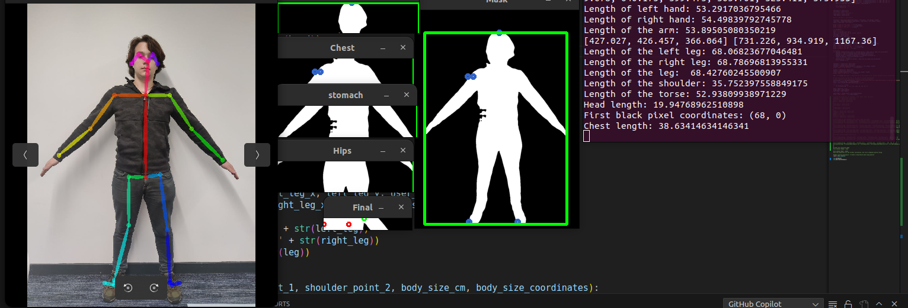

# VIsualSizer

* [Award](#award)
* [Inspiration](#inspiration)
* [Demonstration](#demonstration)
* [What it does](#what-it-does)
* [Calculation logic](#calculation-logic)
* [Future Plans](#future-plans)
* [Technologies](#technologies)

## Award 
This groundbreaking project ascended to the prestigious third place 🥉 at the Hackathon GreatUniHack 2023, held in Manchester, United Kingdom.
Link: https://devpost.com/software/body-measurement 

## Inspiration
Imagine the thrill of discovering a stunning piece of clothing online, the anticipation as you wait for the package to arrive, and the excitement of wearing it for the first time. Now, imagine the crushing disappointment when that garment doesn’t fit and is likely to be thrown away or not used.

The online fashion industry is worth $770 Billion. That is more money than the GDP of many countries...

This project is designed with the purpose to help you avoid the frustration of recieving an ill-fitting garment by revolutionizing the way we choose sizes for our clothes. We aim to automate the process, ensuring a perfect fit every time, transforming the online shopping experience, as well as reduce the quantity of clothing material wasted.

# Demonstration

## What it does
With a given picture and person`s height, it can meassure the length of the following body parts: head, shoulders, hands, torse, chest and legs.

## Calculation logic
Used Python powered by OpenCV, OpenPose, Pytorch, YOLO. Main idea is to use OpenPose to detect the human body points and combine some of them into vectors representing different body parts. Aftwerwards calculate the magnitude of vectors and using a proportion of the given input of the body`s height to the amount of pixels representing the height.

For the chest measurement we used the following approach: Turn the background of the picture into black and the body to white. Iterate over the pixels horizontally to check the difference between white pixels and detect the the beginning of the chest. Do this from the left and right parts, hence we completely eliminate hands from the picture. Calculate the horizontal length of the output image representing the lenght of the chest in pixels. Use the proportion described above to turn the lenght in pixels into cantimeters.

## Future Plans
1. Continue development and create an API so that it can be easily integrated with online shops.
2. Improve the user experience by developing the own web site.
3. Create a Docker package in order to make the installation of the library as easy as possible for everyone.
4. Implement a new functionality for calucalation of other body parts.
5. Implement a functionality to determine which body type this is by turning the body contour into mathematical function and do a mathematical analysis using direvatives.

## Technologies
Project is created with:
* Python 3.10.12
* OpenCV 4.6.0-dev
* OpenPose v1.7.0
* Cuda 11.7.r11.7
* PyTorch 1.13.1+cu117
* YOLO v5
* Ubuntu 22.04.2 LTS
